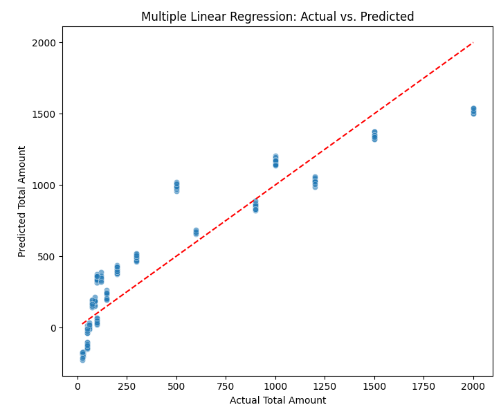
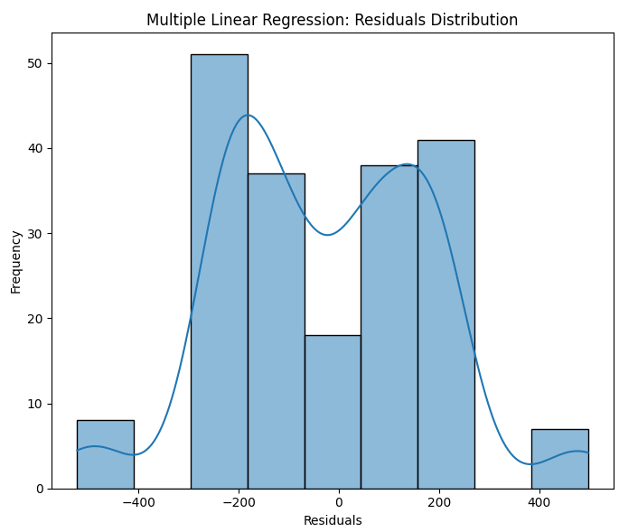

# retail-sales-prediction
Retail sales prediction using linear and polynomial regression with Colab
# Retail Sales Prediction Project

This repository contains a Google Colab notebook demonstrating model development for predicting retail sales.

## Project Overview

The goal of this project is to build and evaluate different regression models to predict the 'Total Amount' of retail transactions based on various features such as Quantity, Price per Unit, Age, Date-derived features (Day of Week, Month), Gender, and Product Category.

## Dataset

The dataset used is `retail_sales_dataset.csv`, which contains transactional data including:
- `Transaction ID`: Unique identifier for each transaction.
- `Date`: Date of the transaction.
- `Customer ID`: Unique identifier for each customer.
- `Gender`: Gender of the customer.
- `Age`: Age of the customer.
- `Product Category`: Category of the product purchased.
- `Quantity`: Number of units purchased.
- `Price per Unit`: Price of each unit.
- `Total Amount`: Total amount of the transaction (target variable).

## Model Development Steps

The Colab notebook covers the following steps:

1.  **Data Preparation**: Conversion of 'Date' to datetime, extraction of 'DayOfWeek' and 'Month', and one-hot encoding of 'Gender' and 'Product Category'.
2.  **Linear Regression and Multiple Linear Regression**: Implementation of simple linear regression (Quantity vs. Total Amount) and multiple linear regression using all selected features.
3.  **Model Evaluation Using Visualization**: Visual analysis of the Multiple Linear Regression model's performance through actual vs. predicted plots and residual distribution.
4.  **Polynomial Regression and Pipeline**: Application of polynomial regression with a pipeline to explore non-linear relationships, specifically using 'Quantity' with a degree of 2.
5.  **Measures for In-sample Evaluation**: Comparison of model performance using R-squared, Mean Squared Error (MSE), Mean Absolute Error (MAE), and Root Mean Squared Error (RMSE).
6.  **Prediction and Decision Making**: Demonstration of how to make predictions with the best-performing model and discussion on how model insights can inform business decisions.

## Key Findings

*(Based on the model development results from our Colab session)*

- The **Multiple Linear Regression model** showed significantly better performance (R-squared: 0.8553) compared to Simple Linear Regression (R-squared: 0.0742) and Polynomial Regression (R-squared: 0.0717) with 'Quantity' as a single feature.
- The coefficients from the Multiple Linear Regression model indicate the relative impact of each feature on 'Total Amount', with 'Quantity' and 'Price per Unit' having strong positive relationships.

## How to Run the Notebook

1.  Clone this repository to your local machine or open it directly in Google Colab.
2.  Ensure you have all the necessary Python libraries installed (e.g., `pandas`, `numpy`, `matplotlib`, `seaborn`, `scikit-learn`). You can install them using `!pip install <library_name>` in Colab.
3.  Run all cells in the provided notebook (`<Model Development>.ipynb`).

## 📊 Visual Highlight

*Example of step 3: Multiple Linear Regression: Actual vs. Predicted.*

## 📊 Visual Highlight

*Example of step 3: Multiple Linear Regression: Residuals Distribution.*

## 📊 Visual Highlight
.png)

*Example of step 4: Polynomial Regression Fit (Degree 2).*

Feel free to explore the code, modify the models, or extend the analysis!

